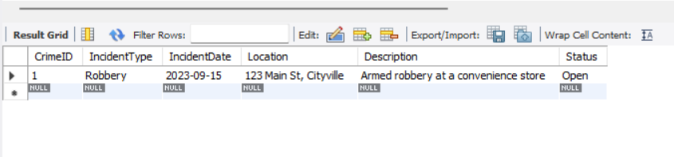
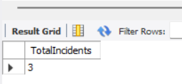
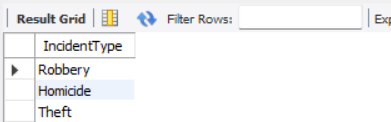
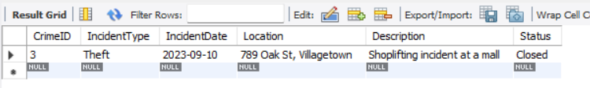
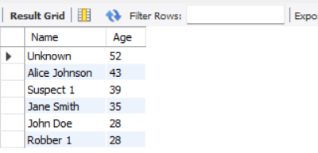
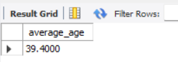
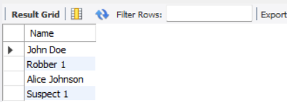
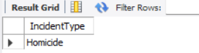

# <p align='center'> Crime Management System - Coding Challenge </p>
### Name: Saravana Kumar S
Superset ID: 5371342<br>
College: Saveetha Engineering college

## Database creation and Inserting the given values
```sql
CREATE TABLE Crime ( 
    CrimeID INT PRIMARY KEY, 
    IncidentType VARCHAR(255), 
    IncidentDate DATE, 
    Location VARCHAR(255), 
    Description TEXT, 
    Status VARCHAR(20) 
); 
 
CREATE TABLE Victim ( 
    VictimID INT PRIMARY KEY, 
    CrimeID INT, 
    Name VARCHAR(255), 
    ContactInfo VARCHAR(255), 
    Injuries VARCHAR(255), 
    FOREIGN KEY (CrimeID) REFERENCES Crime(CrimeID) 
); 
 
CREATE TABLE Suspect ( 
    SuspectID INT PRIMARY KEY, 
    CrimeID INT, 
    Name VARCHAR(255), 
    Description TEXT, 
    CriminalHistory TEXT, 
    FOREIGN KEY (CrimeID) REFERENCES Crime(CrimeID) 
); 
 -- Insert sample data 
INSERT INTO Crime (CrimeID, IncidentType, IncidentDate, Location, Description, Status) 
VALUES 
    (1, 'Robbery', '2023-09-15', '123 Main St, Cityville', 'Armed robbery at a convenience store', 'Open'), 
    (2, 'Homicide', '2023-09-20', '456 Elm St, Townsville', 'Investigation into a murder case', 'Under 
Investigation'), 
    (3, 'Theft', '2023-09-10', '789 Oak St, Villagetown', 'Shoplifting incident at a mall', 'Closed'); 
 
INSERT INTO Victim (VictimID, CrimeID, Name, ContactInfo, Injuries) 
VALUES 
    (1, 1, 'John Doe', 'johndoe@example.com', 'Minor injuries'), 
    (2, 2, 'Jane Smith', 'janesmith@example.com', 'Deceased'),
    (3, 3, 'Alice Johnson', 'alicejohnson@example.com', 'None'); 
INSERT INTO Suspect (SuspectID, CrimeID, Name, Description, CriminalHistory) 
VALUES 
(1, 1, 'Robber 1', 'Armed and masked robber', 'Previous robbery convictions'), 
(2, 2, 'Unknown', 'Investigation ongoing', NULL), 
(3, 3, 'Suspect 1', 'Shoplifting suspect', 'Prior shoplifting arrests');
```

## Quries to solve:
### 1. Select all open incidents
```sql
SELECT * FROM Crime WHERE Status = 'Open';
```


### 2. Find the total number of incidents
```sql
SELECT COUNT(*) AS TotalIncidents FROM Crime;
```


### 3. List all unique incident types
```sql
SELECT DISTINCT IncidentType FROM Crime
```


### 4. Retrieve incidents that occurred between '2023-09-01' and '2023-09-10'
```sql
SELECT * FROM Crime WHERE IncidentDate BETWEEN '2023-09-01' AND '2023-09-10';
```


### 5. List persons involved in incidents in descending order of age.
- Adding and inserting data for the column age: 
```sql
ALTER TABLE Victim ADD Age INT;

UPDATE Victim SET Age = 28 WHERE VictimId = 1;
UPDATE Victim SET Age = 35 WHERE VictimId = 2;
UPDATE Victim SET Age = 43 WHERE VictimId = 3;

ALTER TABLE Suspect ADD Age INT;

UPDATE Suspect SET Age = 28 WHERE SuspectId = 1;
UPDATE Suspect SET Age = 52 WHERE SuspectId = 2;
UPDATE Suspect SET Age = 39 WHERE SuspectId = 3;
```
- List persons involved in incidents in descending order of age.
```sql
SELECT Name, Age FROM Victim UNION
SELECT Name, Age FROM Suspect
ORDER BY Age DESC;
```


### 6. Find the average age of persons involved in incidents
```sql
SELECT AVG(Age) AS average_age FROM (
    SELECT Age FROM Victim UNION
    SELECT Age FROM Suspect
) AS avgage;
```


### 7. List incident types and their counts, only for open cases.
```sql
SELECT IncidentType, COUNT(*) AS Totalcount FROM Crime WHERE Status = 'Open' GROUP BY IncidentType;
```


### 8. Find persons with names containing 'Doe'.
```sql
SELECT Name FROM Victim WHERE Name LIKE '%Doe%'
```


### 9. Retrieve the names of persons involved in open cases and closed cases.
```sql
SELECT Name FROM Victim WHERE CrimeID IN (SELECT CrimeID FROM Crime WHERE Status = 'Open')
UNION
SELECT Name FROM Suspect WHERE CrimeID IN (SELECT CrimeID FROM Crime WHERE Status = 'Open')
UNION
SELECT Name FROM Victim WHERE CrimeID IN (SELECT CrimeID FROM Crime WHERE Status = 'Closed')
UNION
SELECT Name FROM Suspect WHERE CrimeID IN (SELECT CrimeID FROM Crime WHERE Status = 'Closed');
```


### 10. List incident types where there are persons aged 30 or 35 involved.
```sql
SELECT DISTINCT C.IncidentType from Crime C
LEFT JOIN Victim V on V.CrimeID=C.CrimeID
where V.age=30 or V.age=35
```



